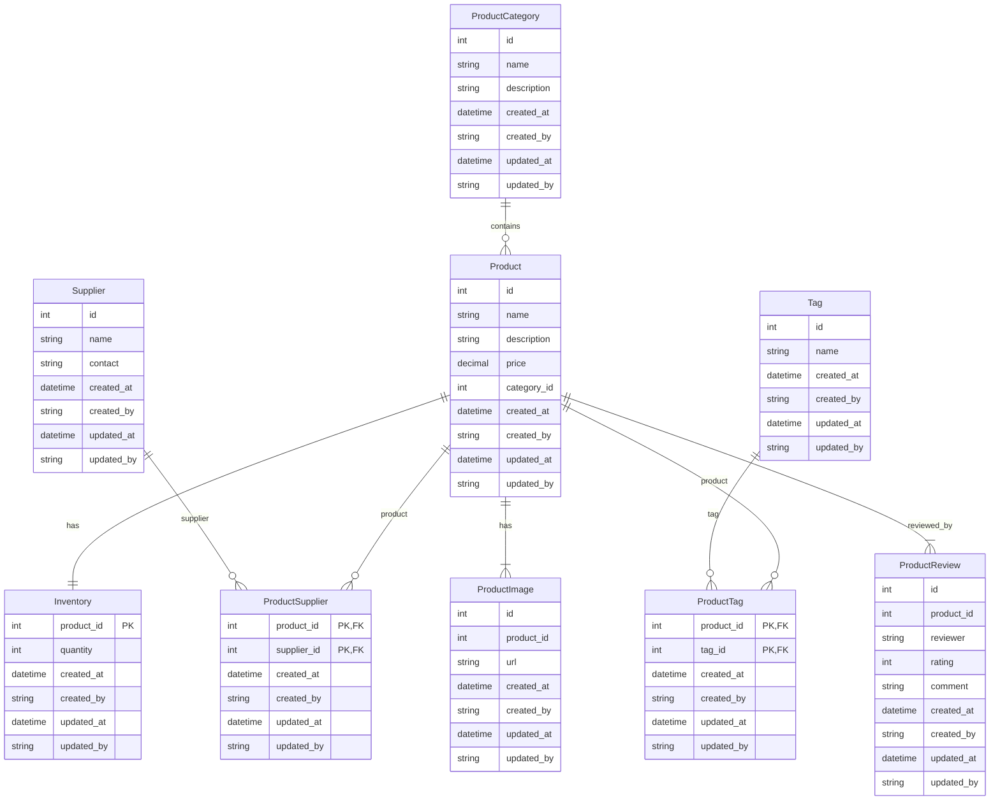

# Spring Boot REST JPA AOP Logging

This project is for practicing and learning Spring Boot, JPA, and related technologies by building a realistic Product Catalog microservice.

> This is a practice/learning project. All features and documentation are designed to help understand real-world patterns and best practices.

## Tech Stack
- Spring Boot 3.2.0
- Java 17
- Spring Web
- Spring Data JPA
- Spring AOP
- H2 Database
- Lombok

## Quick Start

```bash
mvn clean install
mvn spring-boot:run
```

## Project Structure

```
src/
├── main/
│   ├── java/com/amit/practice/
│   │   └── Application.java
│   └── resources/
│       └── application.properties
└── test/
    └── java/com/amit/practice/
```

## Practice Goals

- Practice Spring Boot fundamentals
- Build REST APIs with Spring Web
- Work with JPA/Hibernate ORM
- Implement Spring AOP patterns
- Master logging and auditing best practices (automatic created/updated by and date fields on all entities)
- Demonstrate all major JPA relationships (One-to-Many, Many-to-One, One-to-One, Many-to-Many)
- Design a Product Catalog domain model (see ERD below)
- All entities and join tables include audit fields: createdAt, createdBy, updatedAt, updatedBy

## Planned Domain Model (ERD)

Entities:
- ProductCategory (1) — (M) Product
- Product (1) — (1) Inventory (Inventory uses product_id as its primary key)
- Product (1) — (M) ProductSupplier (join entity)
- Supplier (1) — (M) ProductSupplier (join entity)
- Product (1) — (M) ProductTag (join entity)
- Tag (1) — (M) ProductTag (join entity)
- Product (1) — (M) ProductImage
- Product (1) — (M) ProductReview


## Entity/Table Explanations

Below is a brief explanation of each table/entity in the Product Catalog domain model:

- **ProductCategory**: Represents a category or group for products (e.g., Electronics, Clothing). Contains a unique ID, name, description, and audit fields.
- **Product**: Represents an item for sale. Linked to a ProductCategory. Contains name, description, price, category reference, and audit fields.
- **Inventory**: Tracks the available quantity for each product. Uses product_id as its primary key (one-to-one with Product). Contains quantity and audit fields.
- **Supplier**: Represents a supplier/vendor who provides products. Contains name, contact info, and audit fields.
- **ProductSupplier**: Join table linking Products and Suppliers (many-to-many). Each row represents a product supplied by a supplier. Includes audit fields.
- **Tag**: Represents a tag or label for products (e.g., "New", "Sale"). Contains name and audit fields.
- **ProductTag**: Join table linking Products and Tags (many-to-many). Each row represents a tag assigned to a product. Includes audit fields.
- **ProductImage**: Stores image URLs for products. Each image is linked to a product. Contains URL and audit fields.
- **ProductReview**: Stores customer reviews for products. Each review is linked to a product and includes reviewer name, rating, comment, and audit fields.

### ERD Diagram


