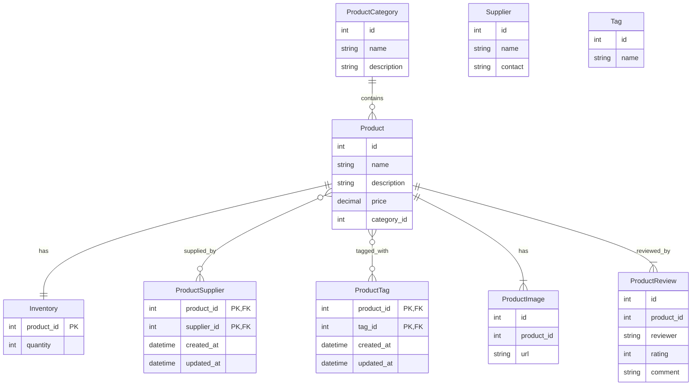

# Spring Boot REST JPA AOP Logging

This project is for practicing and learning Spring Boot, JPA, and related technologies by building a realistic Product Catalog microservice.

> This is a practice/learning project. All features and documentation are designed to help understand real-world patterns and best practices.

## Tech Stack
- Spring Boot 3.2.0
- Java 17
- Spring Web
- Spring Data JPA
- Spring AOP
- H2 Database
- Lombok

## Quick Start

```bash
mvn clean install
mvn spring-boot:run
```

## Project Structure

```
src/
├── main/
│   ├── java/com/amit/practice/
│   │   └── Application.java
│   └── resources/
│       └── application.properties
└── test/
    └── java/com/amit/practice/
```

## Practice Goals

- Practice Spring Boot fundamentals
- Build REST APIs with Spring Web
- Work with JPA/Hibernate ORM
- Implement Spring AOP patterns
- Master logging best practices
- Demonstrate all major JPA relationships (One-to-Many, Many-to-One, One-to-One, Many-to-Many)
- Design a Product Catalog domain model (see ERD below)

## Planned Domain Model (ERD)

Entities:
- ProductCategory (1) — (M) Product
- Product (1) — (1) Inventory (Inventory uses product_id as its primary key)
- Product (M) — (M) Supplier (via ProductSupplier join entity)
- Product (M) — (M) Tag (via ProductTag join entity)
- Product (1) — (M) ProductImage
- Product (1) — (M) ProductReview

### ERD Diagram


